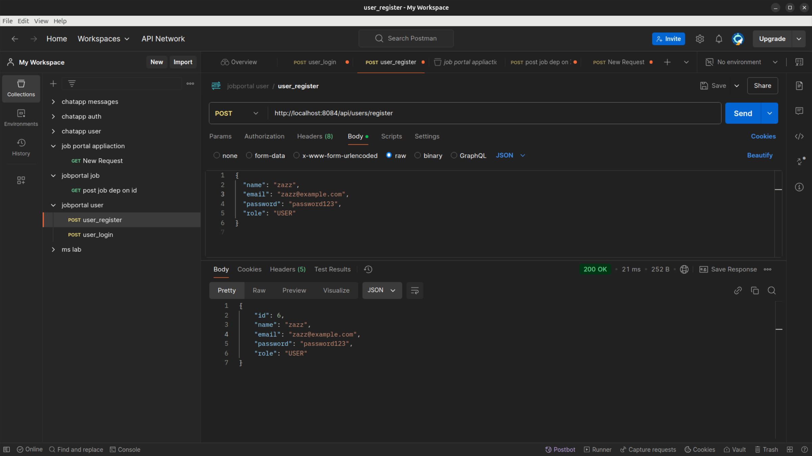

# Job Portal Microservices Application

This is a microservices-based job portal application built using Spring Boot. The application consists of three independent services:

1. **User Service**: Manages user registration and login.
2. **Job Service**: Allows users to post jobs.
3. **Application Service**: Enables users to apply for jobs.

Each service communicates with a MySQL database and runs independently.

---

## Project Structure

```
job-portal-microservices/
├── user-service
│   ├── src/main/java/com/example/userservice
│   ├── src/main/resources
│   ├── pom.xml
│   └── application.properties
├── job-service
│   ├── src/main/java/com/example/jobservice
│   ├── src/main/resources
│   ├── pom.xml
│   └── application.properties
├── application-service
│   ├── src/main/java/com/example/applicationservice
│   ├── src/main/resources
│   ├── pom.xml
│   └── application.properties
└── README.md
```

---

## Prerequisites

- Java 17 or later
- Maven 3.6+
- MySQL database
- Postman (for API testing)

---

## Getting Started

### 1. Clone the Repository
```bash
git clone <repository-url>
cd job-portal-microservices
```

### 2. Set Up MySQL Database
Create the following databases in MySQL:
- `user_service_db`
- `job_service_db`
- `application_service_db`

### 3. Configure `application.properties`
Update the `application.properties` file in each service with the respective database configurations.

Example:
```properties
spring.datasource.url=jdbc:mysql://localhost:3306/user_service_db
spring.datasource.username=<username>
spring.datasource.password=<password>
spring.jpa.hibernate.ddl-auto=update
```

### 4. Build and Run Services

#### User Service
```bash
cd user-service
mvn clean install
mvn spring-boot:run
```
- Runs on `localhost:8084`

#### Job Service
```bash
cd job-service
mvn clean install
mvn spring-boot:run
```
- Runs on `localhost:8085`

#### Application Service
```bash
cd application-service
mvn clean install
mvn spring-boot:run
```
- Runs on `localhost:8086`

---

## API Endpoints

### User Service

#### 1. **Register User**
- **URL**: `POST http://localhost:8081/api/users/register`
- **Request Body**:
  ```json
  {
    "name": "John Doe",
    "email": "john.doe@example.com",
    "password": "password123"
  }
  ```
- **Response**:
  ```json
  {
    "id": 1,
    "name": "John Doe",
    "email": "john.doe@example.com",
    "password": "password123"
  }
  ```

#### 2. **Login User**
- **URL**: `POST http://localhost:8081/api/users/login`
- **Request Body**:
  ```json
  {
    "email": "john.doe@example.com",
    "password": "password123"
  }
  ```
- **Response**:
  ```json
  {
    "id": 1,
    "name": "John Doe",
    "email": "john.doe@example.com",
    "password": "password123"
  }
  ```

### Job Service

#### 1. **Post Job**
- **URL**: `POST http://localhost:8082/api/jobs/post?userId=1`
- **Request Body**:
  ```json
  {
    "title": "Software Engineer",
    "description": "Develop and maintain software applications.",
    "location": "Bangalore",
    "companyName": "TechCorp",
    "salary": 60000
  }
  ```
- **Response**:
  ```json
  {
    "id": 1,
    "title": "Software Engineer",
    "description": "Develop and maintain software applications.",
    "location": "Bangalore",
    "companyName": "TechCorp",
    "salary": 60000,
    "userId": 1
  }
  ```

### Application Service

#### 1. **Apply for Job**
- **URL**: `POST http://localhost:8083/api/applications/apply?userId=1`
- **Request Body**:
  ```json
  {
    "jobId": 1,
    "status": "Applied"
  }
  ```
- **Response**:
  ```json
  {
    "id": 1,
    "userId": 1,
    "jobId": 1,
    "status": "Applied"
  }
  ```

---

## Postman Screenshots
#### 1. **User register**

#### 2. **User login**

#### 3. **Create job**

#### 4. **Apply for job**


---

## Notes

- Ensure all services are running before testing endpoints.
- Use Postman or similar tools for testing API requests.

---

# Future Enhancements

- Add authentication using JWT for secure login.

# Feel free to reach out :

- ### Email: arslaankhurshiedsmt231@gmail.com
- ### GitHub: arslaanKhurshid
- ### LinkedIn: Zaz Arsalan Khursheed


